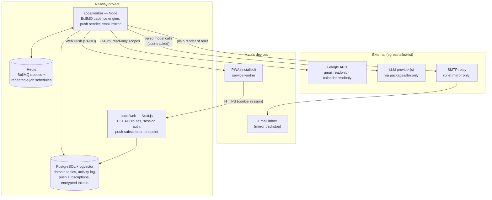

# Mission Control — Architecture (v1)

**Status:** Draft for review · **Date:** June 2026 · **Source of truth for scope:** [PLANNING-BRIEF.md](PLANNING-BRIEF.md)

This document covers deliverable §9.1 of the planning brief: monorepo layout, process topology, and the data flow for one full cadence cycle. Database DDL, the phased build plan, tickets, the eval harness spec, and the risk register are separate deliverables and are intentionally not here (see §10 below).

---

## 1. Overview & Architectural Invariants

Mission Control is a **proactive cadence engine with chat bolted on**. The system's atomic unit is a recurring operating rhythm executed by a background worker: ingest (Gmail/GCal/manual capture) → reconcile against the Commitment Ledger → generate briefs (morning, EOD, weekly, prep) → deliver (push + email mirror) — on a schedule, whether or not the user opens the app. The web app is the approval and reading surface, not the engine.

Four invariants from brief §2.4 are structural commitments. Every design decision below must preserve them, because they are expensive to retrofit:

1. **`owner_id` on every table.** Single-tenant deploy, multi-tenant shape. There is exactly one user in v1, but no query, index, or unique constraint is written without the owner dimension.
2. **Append-only activity log.** Every ingest, extraction, model call, job run, and user action writes to the activity log. There are no UPDATE or DELETE code paths against it. Failures are first-class records — a missed brief is loudly known because the failure row exists and the UI reads it.
3. **Provider-agnostic LLM layer with per-call cost tracking.** All model access goes through `packages/llm`. No app or job imports a provider SDK directly. Every call records provider, model, tokens, cost, latency, and the data categories it contained.
4. **Everything generated is a draft with explicit user disposition.** Autonomy ceiling is Level 2: the system reads, extracts, summarizes, and drafts — it never sends email, writes calendar events, or takes external action. This is enforced *structurally*, not just by policy: Google scopes are read-only (`gmail.readonly`, `calendar.readonly`), and no send/write code path exists. The only outbound traffic is (a) model-provider API calls, (b) web push notifications to Mark's own devices, and (c) the brief email mirror to Mark's own inbox — all delivery of generated artifacts to the owner, never action on anyone's behalf.

### 1.1 Multi-persona readiness

The chief of staff is the first instance of a pattern, not a hardcoded monolith. A "persona" decomposes into things this architecture already treats as data and config: a set of cadence jobs, versioned prompts + Zod schemas, a ContextPacket recipe, artifact kinds, and task→tier entries. The valuable substrate — Commitment Ledger, episodes, semantic memory, activity log, approval primitives, delivery — is persona-agnostic by construction; a future research assistant or PM persona is a new loop over the same substrate, not a fork of the data model.

What *would* be expensive to retrofit is attribution, so it follows the same single-tenant-deploy/multi-tenant-shape logic as `owner_id`:

- **`agent_key`** — a plain string column (value `'chief_of_staff'` everywhere in v1) on `Brief`, `CadenceRun`, `ModelCall`, and prompt-version records, so artifacts, cost, and eval results are attributable per persona without backfill.
- **Namespaced LLM task names** — `cos.morning_brief`, `cos.extract_commitments` — so the tier config and prompt registry are persona-scoped from day one.
- **Artifact `kind` is an open, app-validated string**, not a DB enum — a new artifact type must never require a migration.

Explicitly **not** built now (cheap to add when a second persona exists; speculative versions drift toward the §3 non-goals): agent registry tables, per-agent settings UI, dynamic prompt loading, agent-to-agent orchestration. With the three moves above, adding persona #2 is roughly one weekend session — prompt/schema modules, job definitions, tier entries, a UI tab; no migrations. Caveat: a persona that needs a *new data source* (e.g., web search for a research assistant) is a real integration-scope decision regardless of this mechanism.

---

## 2. Decisions Record

Locked by the brief (§2.3): TypeScript monorepo · Next.js App Router · background worker on BullMQ + Redis · PostgreSQL + pgvector · provider-agnostic LLM layer with Anthropic as default.

Open choices (§10), resolved here:

### 2.1 ORM: Drizzle

SQL-first with the schema as plain TypeScript in-repo — fully legible to Claude Code in a single context. First-class pgvector `vector` column type (Prisma requires `Unsupported()` plus raw SQL for vector ops). `drizzle-kit` emits plain SQL migration files that are reviewable in a PR. No codegen step or query-engine binary in the deploy artifact. Fits "one language, one deploy story."

### 2.2 Hosting: Railway

One dashboard runs all four processes from one repo: the Next.js web service, the worker service, managed Redis, and managed Postgres (pgvector-capable image). Per-service deploys from monorepo subpaths, private networking between services, usage-based pricing that is trivial at single-tenant scale. Fly.io is the named fallback if Railway's Postgres image options become limiting; a VPS adds ops burden with zero v1 benefit.

### 2.3 Gmail sync: History API incremental sync on a 15-minute poll

Store a per-account `historyId` cursor. Each sync run calls `users.history.list` from the cursor, fetches new message IDs via `users.messages.get`, and advances the cursor. On cursor expiry (Gmail returns 404 when the history is too old), fall back to a bounded re-list (`users.messages.list` with an `after:` query from the last successful sync) and reset the cursor.

**First sync (no cursor exists yet):** at OAuth connect, run the same fallback re-list path with `after:` = connect − 30 days — writing episodes and resolving people / `last_contact_at`, but **not** enqueueing extraction for backfilled episodes. Backfilled history is context (prep briefs, reconciliation evidence, person records), not a confirmation-queue flood (R3: queue noise is the existential risk). Then set the cursor from the current profile `historyId`; extraction applies only to content arriving after connect. In-flight commitments are added manually via the ledger UI.

Quota math: `history.list` = 2 units, `messages.get` = 5 units. At 96 polls/day × (2 + ~50 messages/day × 5) ≈ **25K units/day**, against a 1B units/day project quota and 250 units/sec/user — four-plus orders of magnitude of headroom. Pub/Sub push would add a public webhook endpoint and a GCP topic to buy latency the 15-minute cadence (§2.5) doesn't need. Revisit only if a future feature needs sub-minute ingest.

### 2.4 Web push: standard Web Push API (VAPID), no FCM/OneSignal

The `web-push` npm package in the worker, a hand-rolled service worker in the PWA, and push subscriptions stored in Postgres. iOS ≥ 16.4 supports web push **only for home-screen-installed PWAs**, so the app includes an explicit install flow: detect iOS Safari, show an in-app instructional prompt (Share → Add to Home Screen), and request notification permission post-install. The email mirror of every brief (§2.1 of the brief) is the contractual backstop — the habit loop tolerates zero missed briefs, and push on iOS is treated as best-effort until proven reliable (tracked in the risk register deliverable).

### 2.5 Monorepo tooling: plain npm workspaces, no Turborepo

Two apps and three packages on one deploy platform need neither task orchestration nor remote caching, and every tool removed is context Claude Code doesn't spend. Graduation trigger (recorded here the same way BullMQ→Temporal is recorded in the risk register): add Turborepo only when local build/test cycles exceed ~2 minutes or CI exceeds ~10.

### 2.6 Structured output: forced tool-use with JSON Schema, Zod as single source of truth

Every extraction/generation job defines a Zod schema → converted to JSON Schema → passed through the LLM layer as a forced tool definition (Anthropic `tool_choice: {type: "tool", ...}` with `strict: true`) → the response is validated with the same Zod schema. On validation failure: one retry with the schema error fed back, then fail visibly to the activity log (never silently drop a candidate). This is portable across providers (Anthropic tool use / OpenAI structured outputs) and keeps schemas versioned in-repo next to their prompts — which is what the §5 eval-gating workflow needs.

### 2.7 Model tier defaults (config, not code)

The tier map lives in `packages/llm` config; models are referenced by tier everywhere else. Defaults at time of writing:

| Tier | Default model | Used by | Pricing (per MTok in/out) |
|---|---|---|---|
| `cheap` | `claude-haiku-4-5` | Commitment extraction, episode summarization, embedding-adjacent classification | $1 / $5 |
| `top` | `claude-opus-4-8` | Morning Brief, EOD Close, Weekly Review, Meeting Prep synthesis | $5 / $25 | 

A `mid` tier (`claude-sonnet-4-6`, $3/$15) is reserved in the config shape and used only by ask-the-ledger chat (`cos.chat`, Phase 4) — swapping any tier is a config change plus an eval run, never a code change. Daily cost ceiling is a brief-level KPI; the activity log's per-call cost records are the instrumentation (risk-register deliverable owns the threshold).

---

## 3. Monorepo Layout

```
mission-control/
├─ apps/
│  ├─ web/                 # Next.js App Router (Railway service 1)
│  │   ├─ app/             #   PWA: brief reader, confirmation queue, ledger view,
│  │   │                   #   quick-capture + chat, run-health page, settings
│  │   ├─ app/api/         #   API routes: session auth, push subscription, OAuth
│  │   │                   #   connect/callback, capture, confirm/reject actions
│  │   └─ public/          #   manifest.webmanifest, service worker (push handler)
│  └─ worker/              # Long-running Node process (Railway service 2)
│      ├─ src/queues/      #   Queue + repeatable-job definitions (the cadence engine)
│      ├─ src/jobs/        #   Job handlers: ingest, extraction, reconciliation,
│      │                   #   briefs, meeting-prep, notify
│      └─ src/delivery/    #   web-push sender, email mirror (SMTP)
├─ packages/
│  ├─ db/                  # Drizzle schema, drizzle-kit migrations (SQL files),
│  │                       # pgvector setup, client factory
│  ├─ core/                # Domain services, shared by web + worker:
│  │                       #   ingest (gmail/gcal clients, cursor mgmt),
│  │                       #   extraction (prompts + Zod schemas, versioned),
│  │                       #   reconciliation, ContextPacket assembly,
│  │                       #   brief generation, activity-log writer,
│  │                       #   token crypto (libsodium sealed box)
│  └─ llm/                 # Provider-agnostic LLM interface:
│                          #   tier routing, provider adapters (Anthropic default),
│                          #   structured-output helper (Zod → forced tool-use),
│                          #   per-call token/cost tracking → activity log
├─ evals/                  # Extraction eval harness (deliverable §9.7 specs it):
│                          #   anonymized fixtures, precision/recall runner,
│                          #   prompt-version gating
├─ docs/                   # PLANNING-BRIEF.md, ARCHITECTURE.md, INSIGHTS.md
└─ package.json            # npm workspaces root
```

Rationale:

- **`core` is shared by both apps.** The web app needs the same domain services as the worker (a chat-initiated capture runs the same extraction path as an ingested email; a confirmation action writes the same activity-log records). Putting domain logic in either app would force the other to import across app boundaries.
- **`llm` is isolated** so a provider swap or tier remap is a one-package change, and so the cost-tracking invariant has exactly one enforcement point.
- **`evals/` sits outside `packages/`** because it ships nothing — it's a dev/CI harness over `core`'s extraction prompts and schemas.
- **Extraction prompts and their Zod schemas live together in `packages/core`, versioned in-repo** (brief §5): the eval harness imports them by version, and prompt changes are gated on eval runs.

---

## 4. Process Topology

Four runtime components, all on Railway, plus three external services.



Annotations:

- **Egress is a closed list:** Google (read-only), the model provider, web push endpoints, and the SMTP relay. Nothing else. The push and email arrows deliver generated artifacts to the owner — they are not external actions (invariant 4).
- **OAuth tokens are encrypted at rest** with a libsodium sealed box; the key lives in Railway service env vars, never in the repo. KMS is deliberately deferred — sealed-box-with-env-key meets the §7 floor for a single-tenant deploy and the interface (`encryptToken`/`decryptToken` in `core`) is the seam where KMS slots in later.
- **Web and worker share `packages/db` and `packages/core`** but communicate only through Postgres and Redis — no direct HTTP between them. The web app enqueues work (e.g., a chat capture that needs extraction) by adding a BullMQ job; the worker surfaces state (run health, failures) by writing rows the web app reads.
- **Auth-lite:** one hardcoded user behind a real cookie session (e.g., `iron-session`) with a single shared-secret login. Never a query param (§7). All requests still resolve to an `owner_id` — the multi-tenant shape is exercised from day one.

---

## 5. The Cadence Engine (worker design)

### 5.1 Queues

| Queue | Fed by | Handlers |
|---|---|---|
| `ingest` | Repeatable schedule (every 15 min, working hours, `America/Denver`) | Gmail history sync, GCal delta sync → `Episode` rows |
| `extraction` | **Enqueued by ingest completions and manual captures** (event-driven, per brief §2.5 "on new ingested content") | Commitment-candidate extraction (cheap tier, forced tool-use) |
| `reconciliation` | Repeatable schedule (nightly) | Match new episodes against open commitments: done / slipped / contradicted |
| `briefs` | Repeatable schedules (7:00 AM daily, 4:30 PM workdays, Sun 7:00 PM) + meeting-prep scheduler | **Inline pre-sync** (fresh Gmail+GCal sync as the first run-step — artifacts fire outside the ingest window and must not render stale data; on sync failure proceed with stale data, mark the step failed, note staleness in packet meta) → ContextPacket assembly → top-tier generation → `Brief` row |
| `notify` | Enqueued by brief completions | Web push send + email mirror + delivery-status recording |

Meeting prep is the one schedule that isn't a fixed cron: a lightweight repeatable scan job watches flagged calendar events and enqueues a `briefs` job with a **delayed** BullMQ schedule targeting T−45 min for each.

### 5.2 Idempotency and failure contract

Per brief §2.5: every job idempotent, retried with backoff, failures loudly visible.

- **Deterministic job IDs.** Every job is enqueued with a natural key as its BullMQ `jobId` — `morning-brief:2026-06-09`, `ingest:gmail:<account_id>:2026-06-09T13:15` (account-scoped — multiple Gmail accounts are an expected growth path, R2), `extract:episode:<episode_id>`, `meeting-prep:<event_id>`. Re-enqueueing the same logical work is a no-op; a crashed-and-restarted scheduler cannot double-generate a brief.
- **Upsert-by-source-ref writes.** Ingest keys episodes on `(source, raw_ref)`; extraction keys candidates on `(source_ref, extraction content hash)`. Replaying a job converges instead of duplicating.
- **Retries:** BullMQ exponential backoff (e.g., 5 attempts, base 30s) for transient failures (Google 5xx, provider overload). Zod-validation failures get exactly one schema-feedback retry inside the job (see §2.6) before counting as a job failure.
- **Terminal failures are records, not logs.** A job that exhausts retries writes a failed `CadenceRun` row with the error and context. The web app's run-health page is a query over `CadenceRun` — "the Morning Brief did not go out" is a red row Mark sees in-app (and the previous day's brief email not arriving is the out-of-band signal). No silent failures.
- **Every job run is bracketed by the activity log.** Open a `CadenceRun` on start; append step records and model-call records (provider, model, tokens, cost, latency, data categories per §7) as it executes; close with outcome. This is invariant 2 mechanically applied.

### 5.3 BullMQ → Temporal graduation trigger

Not built now (locked). The trigger conditions live in the risk-register deliverable; architecturally, the seam is that job handlers in `apps/worker/src/jobs/` are plain async functions over `core` services — BullMQ-specific code is confined to `src/queues/`. If durability needs outgrow BullMQ (multi-step workflows needing exactly-once across process death, long human-in-the-loop timers), handlers port to Temporal activities without touching domain logic.

---

## 6. Data Flow: One Full Cadence Cycle

A representative 24 hours, from an email arriving to Mark opening the Morning Brief. Every arrow that touches the database also appends to the activity log (noted inline).

```mermaid
sequenceDiagram
    autonumber
    participant G as Gmail/GCal (read-only)
    participant W as Worker (BullMQ)
    participant L as LLM layer (packages/llm)
    participant DB as Postgres (+pgvector)
    participant UI as Web app (PWA)
    participant M as Mark

    Note over W: every 15 min, working hours
    W->>G: history.list from cursor → messages.get (new IDs)
    W->>DB: append Episode rows (keyed on source ref)<br/>+ CadenceRun: ingest steps
    W->>W: enqueue extraction job per new episode

    W->>L: extract candidates (cheap tier,<br/>forced tool-use, versioned prompt+schema)
    L->>DB: ModelCall record: provider, model,<br/>tokens, cost, latency, data categories
    W->>DB: Commitment rows, status=candidate,<br/>with confidence + source_excerpt

    M->>UI: opens confirmation queue
    UI->>DB: confirm / edit / reject (one tap)<br/>status→open or dropped + user-action log<br/>rejections stored as labeled eval signal

    Note over W: nightly
    W->>DB: reconciliation: match new episodes vs open commitments
    W->>DB: status updates (done? slipped? contradicted?)<br/>flagged ones queued for confirmation, not auto-closed

    Note over W: 7:00 AM America/Denver — jobId morning-brief:YYYY-MM-DD
    W->>G: inline pre-sync (gmail + gcal) — the 7 AM run is outside<br/>the ingest window; degrade to stale data on failure, never skip the brief
    W->>DB: assemble ContextPacket: date/schedule,<br/>open commitments (ranked by due/age/counterparty),<br/>semantic memories (vector + recency), related episodes,<br/>preferences, safety/format instructions
    W->>DB: persist ContextPacket (traceability)
    W->>L: generate brief (top tier, structured output)
    L->>DB: ModelCall record (cost-tracked)
    W->>DB: Brief row — immutable, references<br/>context_packet_ref + model_calls_ref
    W->>M: web push (VAPID → service worker)
    W->>M: email mirror (plain render)
    M->>UI: opens brief
    UI->>DB: set opened_at (graduation-gate metric §8.1)
```

Two properties of this flow are deliberate:

- **Full traceability.** A brief references the persisted ContextPacket that produced it and the model calls that generated it. "Why did you say this?" is answerable for every artifact by walking `Brief → ContextPacket → Commitments/Memories/Episodes → source_ref` back to the original email.
- **The human is the only state-advancer for commitments.** Extraction produces `candidate`; reconciliation produces *proposals* to close or flag; only Mark's disposition (confirm/edit/reject in the queue) moves a commitment between `candidate`/`open`/`done`/`dropped`. Auto-accept above a confidence threshold is earned later by measured precision (§5 of the brief), and the schema carries `confidence` from day one so that gate can be added without migration.

---

## 7. Web App Surfaces

Function over form (§2.4) — these are thin pages over `core` services:

| Surface | Purpose |
|---|---|
| Confirmation queue | One-tap confirm / edit / reject of commitment candidates; rejections recorded as labeled eval signal |
| Brief reader | Renders structured brief JSON; sets `opened_at` on view |
| Commitment ledger | Open/owed-to-me/snoozed views, ranked; manual add/edit |
| Quick-capture chat | Chat-shaped capture: every message becomes an episode + extraction, candidates render inline (Phase 1, MC-108); Phase 4 upgrades it to retrieval-grounded ask-the-ledger chat, drafts-only (MC-406) |
| Run health | Reads `CadenceRun`: last runs per job, failures in red, retry button |
| Settings | Google OAuth connect, push enable + iOS install instructions, working-hours window |

Admin beyond this is the SQL console (hack-now column of §2.4).

---

## 8. Cross-Cutting: LLM Layer, Activity Log, Security

### 8.1 `packages/llm`

One entry point, approximately:

```ts
complete<T>(opts: {
  task: TaskName;              // namespaced per persona, e.g. "cos.morning_brief" (§1.1);
                               // maps to tier via config (§2.7)
  schema: z.ZodType<T>;        // forced tool-use, validated response
  packet: ContextPacket;       // or simpler input for extraction tasks
  runRef: CadenceRunRef;       // every call is attributed to a run
}): Promise<T>
```

The layer owns: tier→model resolution, provider adapter dispatch (Anthropic default), Zod→JSON-Schema conversion and response validation with the single schema-feedback retry, and writing the `ModelCall` activity record — cost computed from a static in-repo price table (per-MTok rates in §2.7), tokens from the provider's usage response, plus the data categories the call contained (§7 of the brief). No other package may import a provider SDK; CI can enforce this with a lint rule on imports.

### 8.2 Activity log

Append-only by construction: no DELETE, content columns never rewritten; `core`'s activity-log writer exposes only `append*` functions plus the once-only lifecycle transitions (run close, brief delivery/open timestamps) — see CLAUDE.md invariant 2 for the exact column list. Schema specifics (table split between `cadence_runs`, `run_steps`, `model_calls`, `user_actions`) belong to the schema deliverable.

### 8.3 Security floor (implementation commitments from brief §7)

- OAuth tokens sealed-box-encrypted at rest; key in platform env, never in repo.
- Google scopes read-only only; the OAuth consent config requests nothing else.
- No data egress except the model provider (and artifact delivery to the owner — §4).
- Every model call's activity record lists the data categories included (email content, calendar, memories, etc.).
- Secrets exclusively via Railway env vars; `.env` files git-ignored, `.env.example` documented.
- Single-user auth is a real session cookie, never a query param.

---

## 9. What Could Make This Wrong (watch items)

Pointers, not analysis — the risk register deliverable owns these: iOS PWA push reliability (email mirror is the hedge, install flow is the mitigation) · Gmail historyId expiry handling (fallback re-list is specified in §2.3) · extraction precision (eval harness deliverable) · BullMQ durability limits (Temporal seam in §5.3) · daily model cost (per-call tracking in §8.1 is the instrumentation).

## 10. Companion Deliverables

| Deliverable | Doc | Owns |
|---|---|---|
| §9.2 Database schema | [SCHEMA.md](SCHEMA.md) | Full Drizzle definitions for §4 of the brief, migration strategy, index/constraint choices, `agent_key` attribution columns per §1.1 |
| §9.3 Phased build plan | [BUILD-PLAN.md](BUILD-PLAN.md) | Phase 0–4 session-by-session sequencing with exit criteria |
| §9.4 Epics & tickets | [BACKLOG.md](BACKLOG.md) | Session-sized tickets with acceptance criteria and test expectations |
| §9.5 CLAUDE.md | [../CLAUDE.md](../CLAUDE.md) | Repo conventions, commands, invariants, definition of done |
| §9.6 Risk register | [RISK-REGISTER.md](RISK-REGISTER.md) | The watch items above, with triggers, mitigations, contingencies |
| §9.7 Eval harness spec | [EVAL-SPEC.md](EVAL-SPEC.md) | Fixtures, anonymization workflow, matching rules, metrics, prompt-gating |
